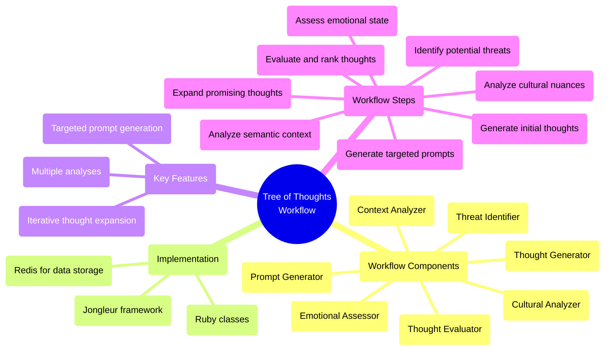

# Flowbots: Orchestrating AI Workflows with Precision

## 🌟 Vision




## 🎯 Core Components

### 1. Nano Bots Integration
- Lightweight, specialized AI-powered bots
- Effortlessly shareable as single, lightweight files
- Configurable via human-readable YAML instructions

### 2. Jongleur Workflow Management
- Process scheduling and management
- Execution of tasks as separate OS processes
- Handling of task dependencies and parallel execution

### 3. Redis-based State Management
- Efficient storage and retrieval of intermediate results
- Enabling stateful interactions between workflow stages

### 4. NLP Processing Pipeline
- Tokenization using PragmaticTokenizer
- Part-of-speech tagging and morphology analysis with ruby-spacy
- Customizable analysis and evaluation stages

### 5. Evaluation and Feedback Loop
- Integration with automatic evaluation tools
- Support for incorporating human feedback
- Dynamic adjustment of agent behavior based on feedback

## 🚀 Example Workflow

Flowbots currently supports a multi-stage NLP processing and evaluation workflow:

1. **Extract**: Tokenize input text and store in Redis
2. **Transform**: Perform linguistic analysis (POS tagging, morphology)
3. **Evaluate**: Assess NLP prompts using automatic evaluation tools
4. **Feedback**: Incorporate human feedback for continuous improvement
5. **Load**: Export results in JSONL format

## 🛠 Getting Started

1. Clone the repository: `git clone https://github.com/your-org/flowbots.git`
2. Install dependencies:
   ```
   bundle install
   ```
3. Set up Redis:
   ```
   sudo apt-get install redis-server
   ```
4. Configure Nano Bots:
   - Create YAML configuration files for your bots
   - Place them in the `cartridges` directory
5. Define your workflow:
   - Create Ruby classes inheriting from `Jongleur::WorkerTask`
   - Define the workflow graph using Jongleur's API
6. Run the workflow:
   ```ruby
   Jongleur::API.run do |on|
     on.completed { |task_matrix| puts "Workflow completed" }
   end
   ```

## 🤝 Contributing

We welcome contributions! Please check out our [Contribution Guidelines](CONTRIBUTING.md) for more information on how to get started.

## 📜 License

Flowbots is released under the [MIT License](LICENSE).

## 🌐 Community

- Join our [Discord server](https://discord.gg/flowbots)
- Follow us on [Twitter](https://twitter.com/FlowbotsAI)
- Read our [blog](https://flowbots.ai/blog) for the latest updates

---

[perplexity thread](https://www.perplexity.ai/search/compile-a-list-of-ruby-librari-TqN2sMgDQpSSrufPc1O6_Q)


