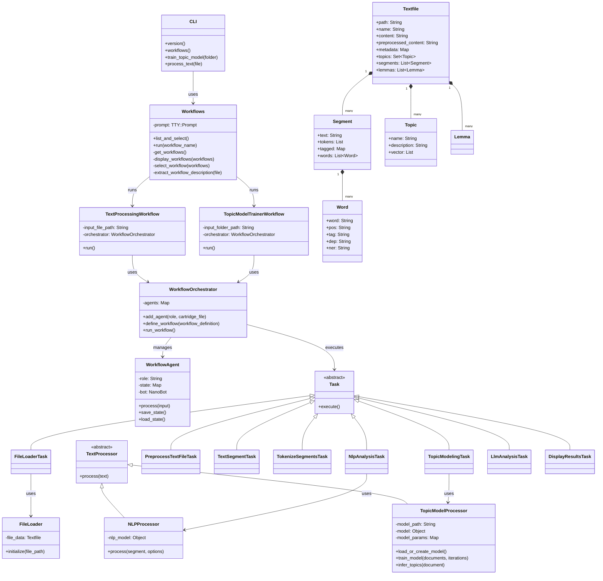
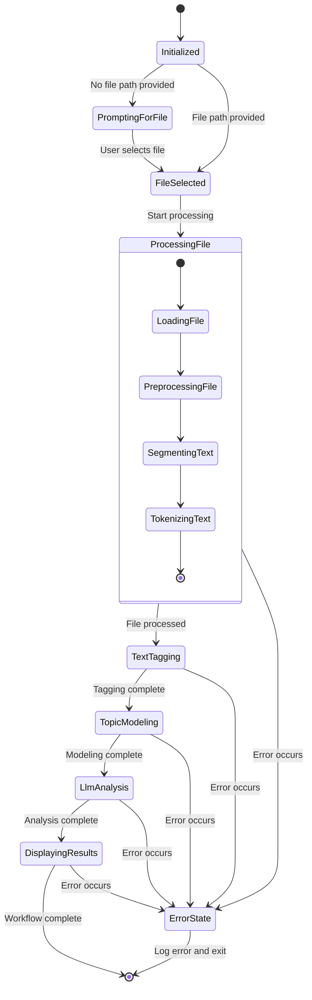
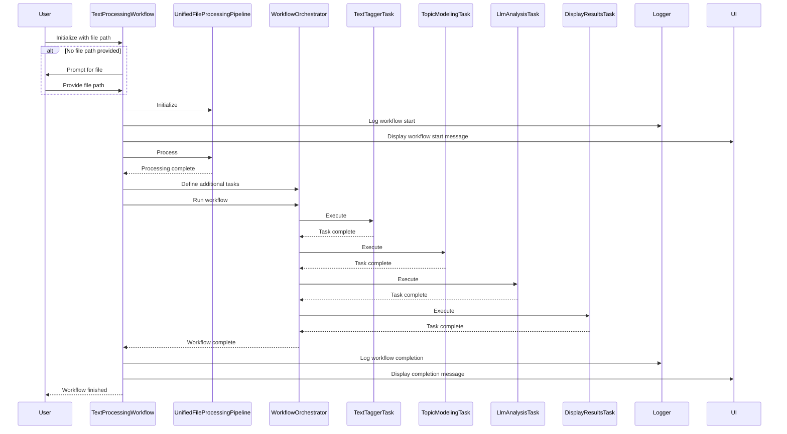
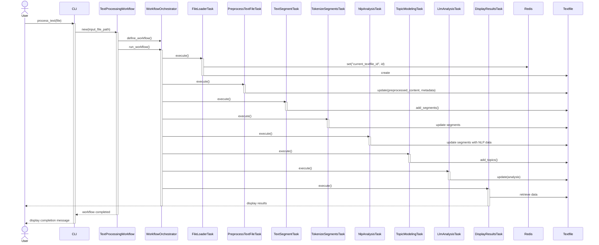

# Flowbots

Flowbots is an advanced text processing and analysis system that combines the power of nano-bots, workflow orchestration, and natural language processing to provide a flexible and powerful tool for document analysis and topic modeling.

## Features

- Text processing workflows for individual files and batch processing
- Advanced NLP capabilities including tokenization, part-of-speech tagging, and named entity recognition
- Topic modeling with dynamic model training and inference
- Flexible workflow system using Jongleur for task orchestration
- Redis-based data persistence using Ohm models
- Custom nano-bot cartridges for specialized AI-powered tasks
- Robust error handling and logging system
- User-friendly CLI interface

## System Architecture

### Class Diagram

# Flowbots Project Overview

Flowbots is an advanced text processing and analysis system that combines the power of nano-bots, workflow orchestration, and natural language processing to provide a flexible and powerful tool for document analysis and topic modeling.

## Key Features

1. Text processing workflows for individual files and batch processing
2. Advanced NLP capabilities including tokenization, part-of-speech tagging, and named entity recognition
3. Topic modeling with dynamic model training and inference
4. Flexible workflow system using Jongleur for task orchestration
5. Redis-based data persistence using Ohm models
6. Custom nano-bot cartridges for specialized AI-powered tasks
7. Robust error handling and logging system
8. User-friendly CLI interface

## Project Structure

The Flowbots project is organized into several key directories:

- `/lib`: Main application code
  - `/components`: Core system components
  - `/processors`: Text and NLP processors
  - `/tasks`: Individual workflow tasks
  - `/workflows`: Workflow definitions
  - `/ohm`: Ohm model definitions
  - `/utils`: Utility functions and classes
- `/nano-bots/cartridges`: Nano-bot cartridge definitions
- `/test`: Test files and test helpers
- `/log`: Log files

## Key Components

1. **CLI**: The main entry point for user interaction, allowing users to select and run workflows.
2. **WorkflowOrchestrator**: Manages the execution of workflows and their constituent tasks.
3. **Task Processors**: Specialized classes for text processing, NLP analysis, and topic modeling.
4. **Ohm Models**: Data persistence layer for storing document information and workflow states.
5. **NanoBot Integration**: Utilizes nano-bot cartridges for specialized AI-powered tasks.
6. **Logging System**: Comprehensive logging for debugging and monitoring.

## Workflow Execution

1. User selects a workflow through the CLI.
2. The selected workflow is initialized and configured.
3. The WorkflowOrchestrator sets up the task graph based on the workflow definition.
4. Tasks are executed in the defined order, with results passed between tasks as needed.
5. Results are stored in Redis and Ohm models for persistence.
6. The workflow completes, and final results are displayed or stored as appropriate.

This project demonstrates a sophisticated approach to text analysis and processing, combining multiple technologies and techniques to create a powerful and flexible system.

# Workflows

Flowbots uses a flexible workflow system to orchestrate various text processing and analysis tasks. The two main workflows defined in the project are:

1. TextProcessingWorkflow
2. TopicModelTrainerWorkflow

## TextProcessingWorkflow

This workflow is designed to process a single text file through a series of tasks.

### Key Steps:

1. **File Loading**: Loads the input file into the system.
2. **Preprocessing**: Extracts metadata and preprocesses the text content.
3. **Text Segmentation**: Splits the text into manageable segments.
4. **Tokenization**: Breaks down segments into individual tokens.
5. **NLP Analysis**: Performs part-of-speech tagging, dependency parsing, and named entity recognition.
6. **Topic Modeling**: Infers topics from the processed text.
7. **LLM Analysis**: Uses a language model to generate insights about the text.
8. **Result Display**: Presents the analysis results to the user.

## TopicModelTrainerWorkflow

This workflow is designed to process multiple files in batches and train a topic model.

### Key Steps:

1. **Batch Processing**: Processes files in batches of a defined size.
2. **File Loading**: Loads each file in the batch.
3. **Preprocessing**: Extracts metadata and preprocesses each file's content.
4. **Text Segmentation**: Splits each file's content into segments.
5. **Tokenization**: Breaks down segments into tokens.
6. **NLP Analysis**: Performs NLP tasks on the tokenized segments.
7. **Filtering**: Filters segments based on predefined criteria.
8. **Accumulation**: Accumulates filtered segments across all processed files.
9. **Topic Model Training**: Trains a topic model using the accumulated segments.

## Workflow Execution

Both workflows use the `WorkflowOrchestrator` class to manage task execution. The orchestrator:

1. Initializes the workflow and its tasks.
2. Sets up the task graph based on the workflow definition.
3. Executes tasks in the defined order.
4. Manages data flow between tasks using Redis for temporary storage.
5. Handles errors and exceptions during workflow execution.

## Workflow Flexibility

The workflow system is designed to be flexible and extensible:

- New workflows can be easily added by creating new workflow classes.
- Existing workflows can be modified by adding, removing, or reordering tasks.
- Tasks are modular and can be reused across different workflows.

This flexibility allows Flowbots to adapt to various text processing and analysis needs.

# Task Processors

Flowbots uses a variety of task processors to handle different aspects of text processing and analysis. These processors are modular and can be combined in workflows to create complex text processing pipelines.

## Key Task Processors

1. **FileLoaderTask**
   - Loads input files into the system.
   - Stores file content in Ohm models for further processing.

2. **PreprocessTextFileTask**
   - Extracts metadata from file content (e.g., YAML front matter in Markdown files).
   - Preprocesses the main content for further analysis.

3. **TextSegmentTask**
   - Splits preprocessed text into manageable segments.
   - Uses the `TextSegmentProcessor` for actual segmentation logic.

4. **TokenizeSegmentsTask**
   - Breaks down text segments into individual tokens.
   - Uses the `TextTokenizeProcessor` for tokenization.

5. **NlpAnalysisTask**
   - Performs various NLP tasks on tokenized segments.
   - Includes part-of-speech tagging, dependency parsing, and named entity recognition.
   - Uses the `NLPProcessor` which wraps the Spacy library for NLP operations.

6. **FilterSegmentsTask**
   - Filters processed segments based on predefined criteria.
   - Removes irrelevant or low-quality segments to improve analysis quality.

7. **TopicModelingTask**
   - Infers topics from processed text segments.
   - Uses the `TopicModelProcessor` which implements topic modeling algorithms.

8. **LlmAnalysisTask**
   - Utilizes a language model (via NanoBot) to generate insights about the text.
   - Provides high-level analysis and summarization of the processed content.

9. **DisplayResultsTask**
   - Formats and displays the results of the text processing and analysis pipeline.

## Task Processor Architecture

Each task processor:

1. Inherits from `Jongleur::WorkerTask` or `Flowbots::BaseTask`.
2. Implements an `execute` method that performs the core task logic.
3. Uses Redis for temporary data storage and passing data between tasks.
4. Interacts with Ohm models for persistent data storage.
5. Includes error handling and logging for robust execution.

## Extensibility

The task processor system is designed to be easily extensible:

- New task processors can be added by creating new classes inheriting from `Jongleur::WorkerTask` or `Flowbots::BaseTask`.
- Existing task processors can be modified or extended to support new functionality.
- Task processors can be combined in different ways within workflows to create custom text processing pipelines.

This modular design allows Flowbots to adapt to various text processing and analysis requirements.

# Flowbots Detailed Operation

## 1. Workflow Initialization

When a user selects a workflow through the CLI, the system initializes the chosen workflow (e.g., TextProcessingWorkflow or TopicModelTrainerWorkflow). The WorkflowOrchestrator sets up the task graph based on the workflow definition.

## 2. Task Execution

The WorkflowOrchestrator executes tasks in the defined order. Each task follows a similar pattern:

1. Retrieve necessary data from Redis or Ohm models.
2. Process the data using specialized processors (e.g., NLPProcessor, TopicModelProcessor).
3. Store the results back in Redis (for temporary storage) or Ohm models (for persistence).

## 3. Data Flow

- Redis is used for storing temporary data and passing information between tasks. This includes file IDs, current batch information, and intermediate processing results.
- Ohm models, backed by Redis, are used for persistent storage of document information, segments, tokens, and analysis results.

## 4. NLP and Topic Modeling

- The NlpAnalysisTask uses the ruby-spacy gem to perform tasks like tokenization, part-of-speech tagging, and named entity recognition.
- The TopicModelingTask uses the tomoto gem to implement topic modeling algorithms.

## 5. LLM Integration

The LlmAnalysisTask integrates with external language models through the NanoBot system. This allows for high-level analysis and insights generation based on the processed text data.

## 6. Error Handling and Logging

Each task and the WorkflowOrchestrator include error handling mechanisms. Errors are caught, logged, and in some cases, trigger the ExceptionAgent for detailed error analysis.

## 7. Batch Processing

For the TopicModelTrainerWorkflow, files are processed in batches. The WorkflowOrchestrator manages the batch state, ensuring all files in a batch are processed before moving to the next batch.

## 8. Result Presentation

The DisplayResultsTask formats the analysis results and presents them to the user through the CLI. This may include summaries, topic distributions, and insights generated by the LLM.

## Key Interactions

1. **CLI <-> WorkflowOrchestrator**: The CLI initiates workflow execution and receives final results.
2. **WorkflowOrchestrator <-> Tasks**: The orchestrator manages task execution order and handles task results.
3. **Tasks <-> Redis**: Tasks use Redis for short-term storage and inter-task communication.
4. **Tasks <-> Ohm Models**: Tasks interact with Ohm models for persistent storage of document data and analysis results.
5. **NLP and Topic Modeling Tasks <-> External Libraries**: These tasks utilize external Ruby gems for specialized processing.
6. **LlmAnalysisTask <-> NanoBot**: This task interacts with the NanoBot system to leverage external language models.

This architecture allows Flowbots to process text data through a series of specialized tasks, each building upon the results of previous tasks, to provide comprehensive text analysis and insights.

# Ruby Gems Used in Flowbots

Flowbots leverages a variety of Ruby gems to provide its functionality. Here's a comprehensive list of the gems used in the project, along with their purposes:

1. **jongleur**
   - Purpose: Workflow orchestration and task management
   - Usage: Core component for defining and executing task workflows

2. **ohm**
   - Purpose: Object-hash mapping for Redis
   - Usage: Data persistence layer for storing document information and workflow states

3. **redis**
   - Purpose: In-memory data structure store
   - Usage: Temporary data storage and passing data between tasks

4. **json**
   - Purpose: JSON parsing and generation
   - Usage: Handling JSON data throughout the application

5. **parallel**
   - Purpose: Parallel processing
   - Usage: Potential use for parallel execution of tasks (not prominently used in the current implementation)

6. **pry** and **pry-stack_explorer**
   - Purpose: Enhanced REPL and debugging tools
   - Usage: Development and debugging

7. **ruby-spacy**
   - Purpose: Ruby bindings for the Spacy NLP library
   - Usage: Natural Language Processing tasks

8. **thor**
   - Purpose: Building command-line interfaces
   - Usage: Creating the CLI for Flowbots

9. **treetop**
   - Purpose: parsing expression grammar (PEG) parser generator
   - Usage: Custom grammar parsing, particularly for Markdown with YAML front matter

10. **yaml**
    - Purpose: YAML parsing and generation
    - Usage: Handling YAML data, particularly in configuration files and document front matter

11. **faraday** and **faraday/multipart**
    - Purpose: HTTP client library
    - Usage: Making HTTP requests, potentially for integrations with external services

12. **logging**
    - Purpose: Flexible logging
    - Usage: Comprehensive logging system throughout the application

13. **tty-box**, **tty-cursor**, **tty-prompt**, **tty-screen**, **tty-spinner**, **tty-table**
    - Purpose: Various terminal output formatting and interaction tools
    - Usage: Creating rich command-line interfaces and displaying formatted output

14. **pastel**
    - Purpose: Terminal output styling
    - Usage: Adding colors and styles to terminal output

15. **highline**
    - Purpose: High-level command-line interface building
    - Usage: Additional CLI features and user input handling

16. **cli-ui**
    - Purpose: CLI user interface components
    - Usage: Enhancing the command-line interface with advanced UI elements

17. **kramdown**
    - Purpose: Markdown parsing and conversion
    - Usage: Handling Markdown content in documents

18. **lingua**
    - Purpose: Natural language detection and processing
    - Usage: Additional NLP capabilities

19. **pragmatic_segmenter**
    - Purpose: Text segmentation
    - Usage: Splitting text into meaningful segments

20. **pragmatic_tokenizer**
    - Purpose: Text tokenization
    - Usage: Breaking text into individual tokens

21. **tomoto**
    - Purpose: Topic modeling
    - Usage: Implementing topic modeling algorithms

22. **minitest** and **minitest/rg**
    - Purpose: Testing framework
    - Usage: Writing and running tests for the application

These gems provide a robust foundation for Flowbots, covering areas such as data persistence, natural language processing, command-line interfaces, HTTP communications, and more. The combination of these tools allows Flowbots to offer a comprehensive text processing and analysis system with a user-friendly interface.
