# Flowbots - Draft

Flowbots is a kind of workflow automation system designed for processing and analyzing text data. It leverages natural language processing, topic modeling, and customizable workflows to extract insights from various text sources.

## Features

-  [ ] File Processing: Support for various file types, including markdown and plain text.
-  [ ] Natural Language Processing: Utilize advanced NLP techniques for text analysis.
-  [ ] Topic Modeling: Extract and analyze topics from large text corpora.
-  [ ] Batch Processing: Handle large volumes of files efficiently with batch processing capabilities.
-  [ ] Redis Integration: Use Redis for caching and temporary data storage during processing.
-  [ ] Exception Handling: Robust error handling and reporting system.
-  [ ] CLI Interface: Easy-to-use command-line interface for running workflows and managing the system.


## Acknowledgments

-   [Ohm](https://github.com/soveran/ohm) for Redis object mapping.
-   [Jongleur](https://github.com/b08x/jongleur) for workflow management.
-   [TTY](https://github.com/piotrmurach/tty) for the CLI interface.

This document outlines the architecture and workflow of our LLM text processing pipeline, which incorporates topic modeling and can handle both text documents and audio transcriptions.

## Text Processing Workflow - Draft

The methods parses text through several phases, from initial input to LLM analysis. It uses a combination of custom Ruby classes, several gems including the Tomoto gem for topic modeling, and Ruby-Nano-Bot cartridges for LLM analysis.


### Aug 1st

```plantuml
stateDiagram-v2
    [*] --> Initialized

    state Initialized {
        [*] --> SetupWorkflow
        SetupWorkflow --> WorkflowCreated : Workflow Created
        WorkflowCreated --> AgentsSetup : Agents Set Up
        AgentsSetup --> ReadyToRun
    }

    ReadyToRun --> RunningWorkflow : Start Execution

    state RunningWorkflow {
        [*] --> CheckWorkflowType
        CheckWorkflowType --> BatchWorkflow : Is Batch
        CheckWorkflowType --> SingleFileWorkflow : Is Single File

        state BatchWorkflow {
            [*] --> NextBatch
            NextBatch --> RunTask
            RunTask --> NextTask : Task Completed
            NextTask --> RunTask : More Tasks
            NextTask --> NextBatch : Batch Completed
            NextBatch --> [*] : All Batches Processed
        }

        state SingleFileWorkflow {
            [*] --> RunTask
            RunTask --> NextTask : Task Completed
            NextTask --> RunTask : More Tasks
            NextTask --> [*] : All Tasks Completed
        }
    }

    RunningWorkflow --> CompletedWorkflow : All Tasks Finished

    CompletedWorkflow --> CleaningUp : Start Cleanup
    CleaningUp --> [*] : Cleanup Finished

    state ErrorHandling {
        TaskError --> ErrorProcessing
        ErrorProcessing --> ResumeWorkflow : Error Handled
        ErrorProcessing --> TerminateWorkflow : Unrecoverable Error
    }

    RunningWorkflow --> ErrorHandling : Error Occurred
    ErrorHandling --> RunningWorkflow : Resume Workflow
    ErrorHandling --> CompletedWorkflow : Terminate Workflow
```


### July 31st


> Right, so, first we take your text (or ramblings, as the case may be), and the method ruthlessly dissects it with algorithms and a sprinkle of Ruby magic.

## Workflow Phases


### Workflow Initiation

```mermaid
sequenceDiagram
    participant User as 👤 User
    participant CLI as 💻 CLI
    participant TPW as 🔄 TextProcessingWorkflow

    User->>CLI: process_text <file_path>
    CLI->>TPW: new(file_path)
    TPW->>TPW: run()
    TPW->>TPW: setup_workflow()
```



In this phase:

-   The user initiates the workflow through the CLI.
-   The `TextProcessingWorkflow` is created and set up.

> So, the workflow kicks off when our eager user pokes the CLI with a file. The CLI then spins up the `TextProcessingWorkflow` and gets the ball rolling.

### Text Processing Phase

```mermaid
sequenceDiagram
    participant TPW as 🔄 TextProcessingWorkflow
    participant TP as 📝 TextProcessor
    participant TS as ✂️ TextSegmenter
    participant SNLP as 🧠 SpacyNLP
    participant Redis as 🗄️ Redis

    TPW->>TP: process_file(file_path)
    TP->>TP: process(text)
    TP->>TS: new(text, options)
    TS->>TS: execute()
    alt text is array
        TS->>TS: segment_array()
    else text is string
        TS->>TS: segment_string()
    end
    TS-->>TP: return segments
    TP->>SNLP: process segments
    SNLP-->>TP: return processed segments
    TP-->>TPW: return processed_text
    TPW->>Redis: set("processed_text", processed_text.to_json)
```



Key features:

-   Handles both text documents and audio transcriptions.
-   Segments text using `TextSegmenter`.
-   Processes text using SpacyNLP.
-   Stores processed text in Redis.

> Alright, so the text processing workflow ingests text, slices and dices it into manageable chunks, then feeds it to the SpacyNLP engine for analysis. The processed output is finally stashed away in Redis for later retrieval.

### Topic Modeling Phase

#TODO: update graphs

```mermaid
sequenceDiagram
    participant TPW as 🔄 TextProcessingWorkflow
    participant TMT as 🔍 TopicModelingTask
    participant TMM as 📊 TopicModelManager
    participant Redis as 🗄️ Redis

    TPW->>TMT: execute()
    TMT->>Redis: get("processed_text")
    Redis-->>TMT: return raw_text
    TMT->>TMT: JSON.parse(raw_text)
    TMT->>TMM: new(model_path)
    alt model not trained
        TMT->>TMM: train_model(processed_text)
        TMM-->>TMT: model trained
    end
    TMT->>TMM: infer_topics(text)
    TMM-->>TMT: return topics
    TMT->>Redis: set("topics", topics.to_json)
```



Key features:

-   Loads or creates a topic model using `TopicModelManager`.
-   Trains the model if necessary.
-   Infers topics from the processed text.
-   Stores inferred topics in Redis.

> Ah, the Topic Modeling Phase. Where we sift through the textual muck to unearth those shimmering nuggets of thematic gold. It's like panning for gold, but instead of a pan, we have a TopicModelManager, and instead of gold, we have, well, topics.

#### Integration with Workflow

To use the  `TopicModelingTask` in your workflow, update the `TextProcessingWorkflow` class:

```ruby
#TODO example...
```

> So, we've tidied up the code and tucked away the topic modeling bits into their own module.

### LLM Analysis Phase

```mermaid
sequenceDiagram
    participant TMT as 🔍 TopicModelingTask
    participant AAT as 🔬 LLMAnalysisTask
    participant Redis as 🗄️ Redis

    TMT->>AAT: execute()
    AAT->>Redis: get("processed_text")
    AAT->>Redis: get("topics")
    Redis-->>AAT: return processed_text and topics
    AAT->>AAT: perform LLM analysis
    AAT->>Redis: set("analysis_result", analysis_result.to_json)
```



Key features:

-   Retrieves processed text and topics from Redis.
-   Performs LLM analysis using a nano-bot cartridge.
-   Stores analysis results in Redis.

> The LLM Analysis Task, digs through the processed text and topics from Redis and performs its assigned LLM analysis. The results, hopefully useful, are then sent back to the Redis storehouse. These can be layer for fun or enjoyment.


* * *

## todos

## Configuration Management

**Problem:** Hardcoded paths and settings within the codebase make it difficult to manage different environments (development, testing, production).

**Solution:** Utilize environment variables and a configuration file to externalize settings.

**Example:**

1.  **Create a configuration file (e.g., `config/application.yml`)**:

```yaml
development:
  redis_host: localhost
  redis_port: 6379
  model_path: "#{ENV['HOME']}/Workspace/flowbots/models/topic_model.lda.bin"
production:
  redis_host: redis.example.com
  redis_port: 6380
  model_path: /app/models/topic_model.lda.bin
```

2.  **Load configuration in your Ruby code:**

```ruby
require 'yaml'

config = YAML.load_file('config/application.yml')[ENV['RAILS_ENV'] || 'development']

# Access configuration values
redis_host = config['redis_host']
model_path = config['model_path']
```

## Containerization with Docker

**Problem:** Dependency management and ensuring consistent execution across environments can be challenging.

**Solution:** Create a Docker image for the application.

**Example (Dockerfile):**

```dockerfile
FROM ruby:3.1

RUN apt-get update && apt-get install -y python3-pip
RUN pip3 install spacy
RUN python3 -m spacy download en_core_web_sm

RUN gem install ruby-spacy sinatra

WORKDIR /app
COPY ./app/spacy_server.rb /app/

CMD ["ruby", "spacy_server.rb"]
```

Create a `Dockerfile.workflow` for your main workflow:

```dockerfile
FROM ruby:3.1

RUN gem install redis

WORKDIR /app
COPY ./app /app

CMD ["ruby", "main.rb"]
```



```mermaid
sequenceDiagram
    participant TPW as 🔄 TextProcessingWorkflow
    participant TP as 📝 TextProcessor
    participant TS as ✂️ TextSegmenter
    participant RubySpacy as 🐳 Ruby-Spacy Service
    participant Redis as 🗄️ Redis Service

    TPW->>TP: process_file(file_path)
    TP->>TP: process(text)
    TP->>TS: new(text, options)
    TS->>TS: execute()
    alt text is array
        TS->>TS: segment_array()
    else text is string
        TS->>TS: segment_string()
    end
    TS-->>TP: return segments
    TP->>RubySpacy: POST /process (segments)
    RubySpacy-->>TP: return processed segments
    TP-->>TPW: return processed_text
    TPW->>Redis: set("processed_text", processed_text.to_json)
```

## CI/CD Pipeline with GitHub Actions

**Problem:** Manual testing and deployment processes are time-consuming and error-prone.

**Solution:** Implement a CI/CD pipeline using GitHub Actions.

**Example (.github/workflows/ci-cd.yml):**

```yaml
name: CI/CD Pipeline

on: [push]

jobs:
  build-and-test:
    runs-on: ubuntu-latest
    steps:
      - uses: actions/checkout@v2
      - name: Install Ruby
        uses: ruby/setup-ruby@v1
        with:
          ruby-version: 2.7
      - name: Install dependencies
        run: bundle install
      - name: Run tests
        run: bundle exec rspec

  build-and-push-image:
    needs: build-and-test
    runs-on: ubuntu-latest
    steps:
      - uses: actions/checkout@v2
      - name: Login to Docker Hub
        uses: docker/login-action@v1
        with:
          username: ${{ secrets.DOCKER_USERNAME }}
```
