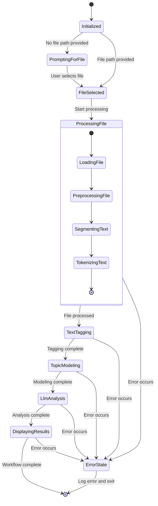
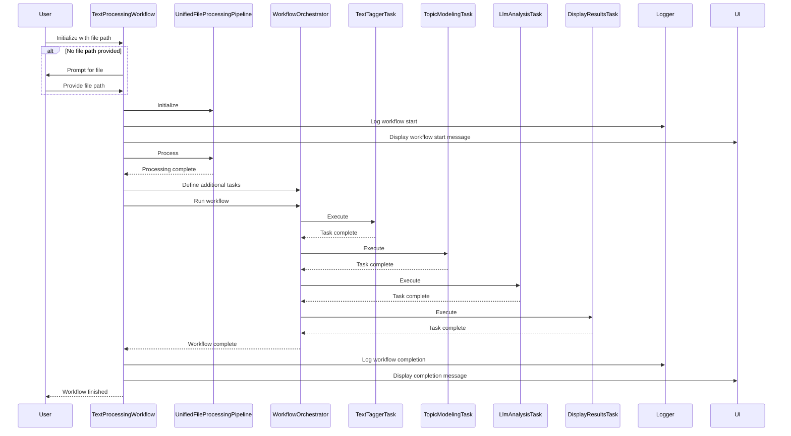
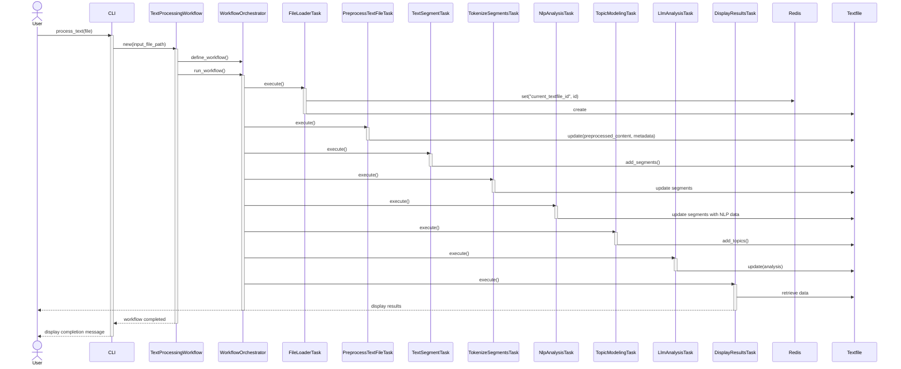

# Workflows

Flowbots uses a flexible workflow system to orchestrate various text processing and analysis tasks. The two main workflows defined in the project are:

1. TextProcessingWorkflow
2. TopicModelTrainerWorkflow

## TextProcessingWorkflow

This workflow is designed to process a single text file through a series of tasks.

#### Key Steps:

1. **File Loading**: Loads the input file into the system.
2. **Preprocessing**: Extracts metadata and preprocesses the text content.
3. **Text Segmentation**: Splits the text into manageable segments.
4. **Tokenization**: Breaks down segments into individual tokens.
5. **NLP Analysis**: Performs part-of-speech tagging, dependency parsing, and named entity recognition.
6. **Topic Modeling**: Infers topics from the processed text.
7. **LLM Analysis**: Uses a language model to generate insights about the text.
8. **Result Display**: Presents the analysis results to the user.

## TopicModelTrainerWorkflow

This workflow is designed to process multiple files in batches and train a topic model.

#### Key Steps:

1. **Batch Processing**: Processes files in batches of a defined size.
2. **File Loading**: Loads each file in the batch.
3. **Preprocessing**: Extracts metadata and preprocesses each file's content.
4. **Text Segmentation**: Splits each file's content into segments.
5. **Tokenization**: Breaks down segments into tokens.
6. **NLP Analysis**: Performs NLP tasks on the tokenized segments.
7. **Filtering**: Filters segments based on predefined criteria.
8. **Accumulation**: Accumulates filtered segments across all processed files.
9. **Topic Model Training**: Trains a topic model using the accumulated segments.

## Workflow Execution

Both workflows use the `WorkflowOrchestrator` class to manage task execution. The orchestrator:

1. Initializes the workflow and its tasks.
2. Sets up the task graph based on the workflow definition.
3. Executes tasks in the defined order.
4. Manages data flow between tasks using Redis for temporary storage.
5. Handles errors and exceptions during workflow execution.

## Workflow Flexibility

The workflow system is designed to be flexible and extensible:

- New workflows can be easily added by creating new workflow classes.
- Existing workflows can be modified by adding, removing, or reordering tasks.
- Tasks are modular and can be reused across different workflows.

This flexibility allows Flowbots to adapt to various text processing and analysis needs.

